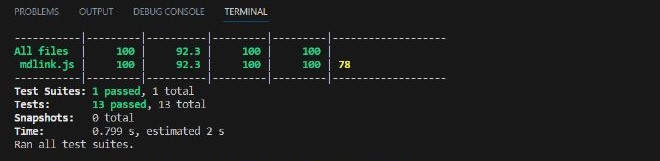

# Markdown Links

<div align="center">
  
  ### Tecnologias utilizadas:  

  <br>
   
  
  
  
  
  <br>
  </div>

  ---


## Índice

* [1. Resumo do projeto](#1-resumo-do-projeto)
* [2. Considerações gerais](#2-considerações-gerais)
* [3. Fluxograma](#3-fluxograma)
* [4. Testes](#4-Testes)
* [5. Github Projects](#5-github-projects)

***

## 1. Resumo do projeto

Markdown é uma linguagem de marcação muito popular entre os programadores. É usada em muitas plataformas que manipulam texto (GitHub, fórum, blogs e etc) e é muito comum encontrar arquivos com este formato em qualquer repositório (começando pelo tradicional README.md).

Os arquivos Markdown normalmente contém links que podem estar quebrados, ou que já não são válidos, prejudicando muito o valor da informação que está ali.

Considerando esta informação, desenvolvi uma ferramenta de linha de comando (CLI) juntamente com uma biblioteca em Javascript que permite a leitura de arquivos Markdown presentes na máquina do usuário e verifica a existência de links nesses arquivos. Além disso, é possível realizar a validação dos links e obter suas estatísticas relevantes. Essa biblioteca é disponibilizada como um executável que pode ser invocado via linha de comando ou ser importado usando o "require" para ser utilizado em qualquer outro código.

## 2. Considerações gerais

### 1) Instalação 

O módulo poder ser **instalado** com o seguinte comando:

  ```sh
 $ npm install md-links/Nivicris/SAP010-md-links
  ```
`Após a instalação bem-sucedida, verifique se você possui um arquivo com a extensão .md contendo links dentro dele.`

### 2) CLI (Interface de Linha de Comando)

A aplicação pode ser acionada de forma executável por meio do terminal da seguinte maneira:

```sh
md-links <path-to-file> 
```

`Retorna o arquivo Markdown (a partir da rota que recebeu como argumento), analisa o arquivo e imprimir os links que vão sendo encontrados, junto com a rota do arquivo onde aparece e o texto encontrado dentro do link.`


```sh
md-links <path-to-file> --validate
```
`Se passamos a opção --validate, o módulo deve fazer uma requisição HTTP para verificar se o link funciona ou não. Se o link resultar em um redirecionamento a uma URL que responde ok, então consideraremos o link como ok.`


```sh
md-links <path-to-file> --stats
```
`Se passamos a opção --stats o output (saída) será um texto com estatísticas básicas sobre os links.`


```sh
md-links <path-to-file> --stats --validate
```
`Também podemos combinar --stats e --validate para obter estatísticas que necessitem dos resultados da validação.`


## 3. Fluxograma 

A programação do projeto foi elaborada utilizando o fluxograma apresentado a seguir:


## 4. Testes

A execução dos testes foi feito através do Jest



## 5. Github Projects

Utilizei o Github Projects para organizar o backlog das implementações da biblioteca por meio de issues e milestones. 


***

<div align="center">
Desenvolvido por: 
  

  Nívia Miranda <br> 
  <a href="https://www.linkedin.com/in/niviacristina/">Linkedin</a> | <a href="https://github.com/Nivicris">Github</a>
  <br>
 